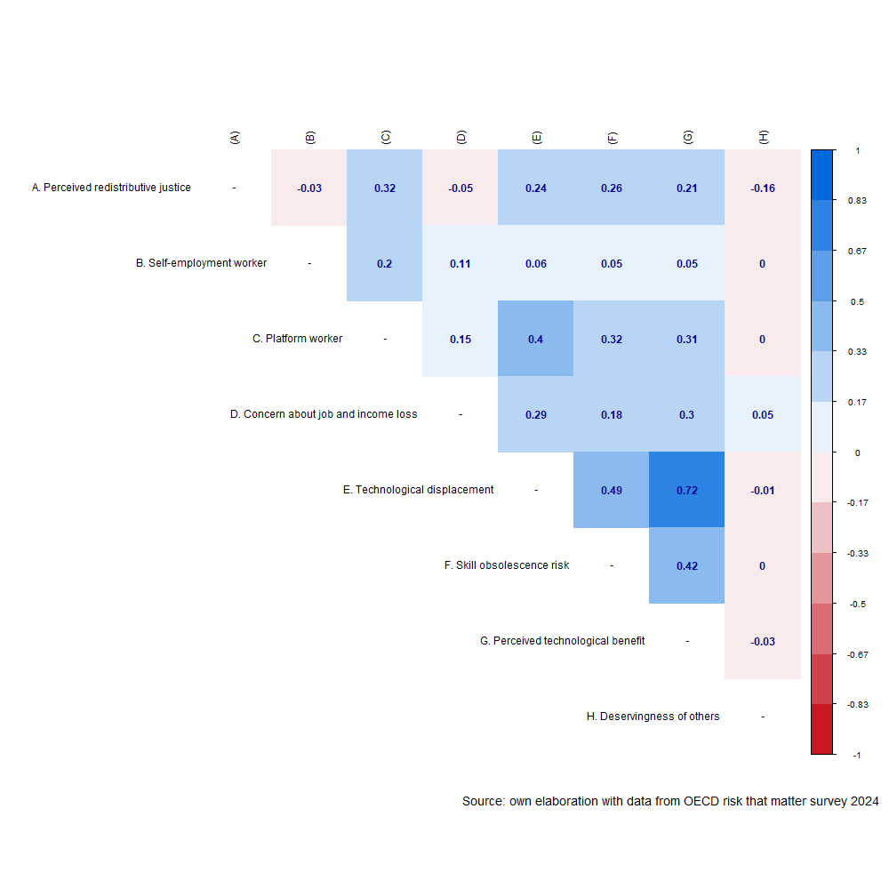


```{r ejemplo-modelo-tabla}
#| echo: false
#| warning: false
#| tbl-cap: "Resumen comparativo de modelos"
#| tbl-label: tbl-modelos


library(knitr)
knitr::opts_chunk$set(echo = TRUE, include = TRUE, warning = FALSE, message = FALSE, cache = TRUE)

table_format <- if(is_html_output()) {
  "html"
} else if(is_latex_output()) {
  "latex"
}
table_format2 <- if(is_html_output()) {
  T
} else if(is_latex_output()) {
  F
}

options(kableExtra.html.bsTable = T)
options(knitr.kable.NA = "")
```

```{r}
#| label: packages2
#| echo: false
#| include: false


if (! require("pacman")) install.packages("pacman")

pacman::p_load(tidyverse, 
               sjmisc, 
               sjPlot, 
               lme4, 
               here, 
               performance,
               marginaleffects,
               texreg, 
               ggdist,
               kableExtra,
               ggalluvial, 
               shadowtext,
               MetBrewer,
               patchwork,
               sjlabelled,
               summarytools,
               interactions,
               cowplot,
               ggpubr,
               ordinal,
               emmeans)


options(scipen=999)
rm(list = ls())
```

```{r}
#| label: data2
#| echo: false
#| include: false 

load(file=here::here("input/proc/data.RData"))
load(file=here::here("input/proc/digitalization.RData"))
load(file=here::here("input/proc/country_data.RData"))

# Generate analytical sample
data <- data %>% select(ctrcode,country, distributive, sex, age, educ, income, selfemploy, unnemployment, platform, tecnoestres, pos_tecnoestres, skills, deservingness, gdp_2024, welfare_regime, weight)

data <- na.omit(data)

data$distributive  <- set_label(x = data$distributive, label = "Redistributive justice")
data$tecnoestres  <- set_label(x = data$tecnoestres, label = "Technological displacement	")
data$pos_tecnoestres  <- set_label(x = data$pos_tecnoestres, label = "Perceived technological benefit")
data$skills  <- set_label(x = data$skills, label = "Lose job due skills")
data$unnemployment  <- set_label(x = data$unnemployment, label = "Lose job")

data$deservingness <- as.numeric(as_factor(data$deservingness))
data$deservingness  <- set_label(x = data$deservingness, label = "Deservingness of others")
data$gdp_2024  <- set_label(x = data$gdp_2024, label = "GDP per-capita")

data$selfemploy  <- set_label(x = data$selfemploy, label = "Self-empleoyment worker")
data$platform  <- set_label(x = data$platform, label = "Platform worker")

data$sex  <- set_label(x = data$sex, label = "Sex")
data$age  <- set_label(x = data$age, label = "Age group")
data$educ  <- set_label(x = data$educ, label = "Educational level")

```


```{r}
#| label: correlation
#| echo: false
#| include: false 


mat_full<- 
data %>%
  select(distributive, selfemploy, platform, unnemployment, tecnoestres, pos_tecnoestres, skills, deservingness
         ) %>% 
  mutate_all(as.numeric) %>% 
  psych::mixedCor()

cor_full <- as.matrix(mat_full$rho)
diag(cor_full) = NA #set diagonal values to NA
# Set Row names of the matrix
rownames(cor_full) <- c("A. Perceived redistributive justice",
                        "B. Self-employment worker",
                        "C. Platform worker",
                        "D. Concern about job and income loss",
                     "E. Technological displacement",
                     "F. Skill obsolescence risk",
                     "G. Perceived technological benefit",
                     "H. Deservingness of others")
#set Column names of the matrix
colnames(cor_full) <-c("(A)", "(B)","(C)","(D)", "(E)", "(F)", "(G)", "(H)")
#Plot the matrix using corrplot
png("output/figures/corrplot.png",width=1000,height=1000, pointsize = 12)
corrplot::corrplot(cor_full,
  method = "color", # Cambia los círculos por color completo de cada cuadrante
  addCoef.col = "#000390", # Color de los coeficientes
  type = "upper", # Deja solo las correlaciones de arriba
  tl.col = "black", # COlor letras, rojo por defecto
  col=colorRampPalette(c("#c71824", "white", "#0068DC"))(12),
  bg = "white",
  na.label = "-")
# Agregar caption
grid::grid.text("Source: own elaboration with data from OECD risk that matter survey 2024", x = 0.99, y = 0.1, just = "right", gp = grid::gpar(fontsize = 14, col = "black"))
dev.off()
```


@fig-correlation presents a correlation matrix of the main variables analyzed. In this matrix, the correlations vary between low and moderate negative and positive values. The main correlation effects are between perceived redistributive justice and being a platform worker (r=0,32, p<0.001), the perceived technological displacement (r=0,24, p<0,001), the skill obsolescence risk (r=0,26, p<0,001), and the perceived technological benefit (r=0,21, p<0,001) which are positive and moderated effects. In other sence, the deservingess of others has a negative and moderated effect (r=0,16, p<0,01).

Regarding the independent variables, the main correlation effects are between the corcern about job and income loss and being a platform worker (r=0,15, p<0,001), and with the perceived of technological change variables. Between this this three last variables, the correlations effects are positive and significant, contrary to the initial intuitions.

```{r echo=FALSE, fig.align='center'}
#| label: fig-correlation
#| fig-cap: "Correlation matrix of the main variables"
#| fig-cap-location: top

 
```


## Multilevel ordinal logistic regression models

```{r}
#| echo: false
#| include: false 

data$selfemploy <- set_labels(data$selfemploy,
            labels=c( "No"=1,
                      "Yes"=2))
data$platform <- set_labels(data$platform,
            labels=c( "No"=1,
                      "Yes"=2))

data$distributive <- as_factor(data$distributive)

m0 <- clmm(distributive ~ 1 + (1 | ctrcode), 
                data = data, weights=weight)
performance::icc(m0, by_group = T)


reg1 <- clmm(distributive ~ selfemploy + platform + (1|ctrcode), data=data, weights=weight)
reg2 <- clmm(distributive ~ selfemploy + platform + unnemployment + (1|ctrcode), data=data, weights=weight)
reg3 <- clmm(distributive ~ selfemploy + platform + unnemployment + tecnoestres + skills + pos_tecnoestres + (1|ctrcode), data=data, weights=weight)
reg4 <- clmm(distributive ~ selfemploy + platform + unnemployment + tecnoestres + skills + pos_tecnoestres + deservingness + (1|ctrcode), data=data, weights=weight)

reg5 <- clmm(distributive ~ selfemploy + platform + unnemployment + tecnoestres + skills + pos_tecnoestres + deservingness + welfare_regime+ (1|ctrcode), data=data, weights=weight)
reg6 <- clmm(distributive ~ sex + age + educ + income + selfemploy + platform + unnemployment + tecnoestres + skills + pos_tecnoestres + deservingness + welfare_regime+ (1|ctrcode), data=data, weights=weight)

reg7 <- clmm(distributive ~ sex + age + educ + income + selfemploy + platform*selfemploy + unnemployment + tecnoestres + skills + pos_tecnoestres + deservingness + welfare_regime+ (1|ctrcode), data=data, weights=weight)
reg8 <- clmm(distributive ~ sex + age + educ + income + selfemploy*welfare_regime + platform + unnemployment + tecnoestres + skills + pos_tecnoestres + deservingness + welfare_regime+ (1|ctrcode), data=data, weights=weight)
reg9 <- clmm(distributive ~ sex + age + educ + income + selfemploy + platform*welfare_regime + unnemployment + tecnoestres + skills + pos_tecnoestres + deservingness + welfare_regime+ (1|ctrcode), data=data, weights=weight)
reg10 <- clmm(distributive ~ sex + age + educ + income + selfemploy + platform + unnemployment*welfare_regime + tecnoestres + skills + pos_tecnoestres + deservingness + welfare_regime+ (1|ctrcode), data=data, weights=weight)
reg11 <- clmm(distributive ~ sex + age + educ + income + selfemploy + platform + unnemployment + tecnoestres*welfare_regime + skills + pos_tecnoestres + deservingness + welfare_regime+ (1|ctrcode), data=data, weights=weight)
reg12 <- clmm(distributive ~ sex + age + educ + income + selfemploy + platform + unnemployment + tecnoestres + skills + pos_tecnoestres + deservingness*welfare_regime + welfare_regime + (1|ctrcode), data=data, weights=weight)
```


```{r echo=FALSE, results='asis'}
#| label: tbl-modelos
#| tbl-cap: "Multilevel models for retributive preferences"
#| tbl-cap-location: top

omit <- "(1|2)|(2|3)|(3|4)|(4|5)|(sex)|(age)|(educ)|(income)"

ccoef <- list(
  "selfemploy2" = "self-employed worker (ref. No)",
  "platform2" = "Platform worker (ref. No)",
  "unnemployment" = "Concern about job and income loss",
  "tecnoestres" = "Technological displacement",
  "skills" = "Skill obsolescence risk",
  "pos_tecnoestres" = "Perceived technological benefit",
  deservingness = "Deservingness of others",
  "welfare_regimeSocial-democratic" = "Social-democratic",
  "welfare_regimeConservative" = "Conservative"
  )

knitreg(list(reg1, reg2, reg3, reg4, reg5, reg6),
        custom.model.names = c(paste0("Model ", seq(1:6))),caption.above = T,
        caption = NULL,
        stars = c(0.05, 0.01, 0.001),
        omit.coef = omit,
        custom.coef.map = ccoef,
        digits = 3,
        groups = list("Welfare regime (Ref.= Liberal)" = 8:9),
        custom.note = "Note: Cells contain regression coefficients with standard errors in parentheses. %stars.\nModel 6 is controlled by sex, age and income with significant effects and education with no significant effect",
        leading.zero = T,
        use.packages = F,
        booktabs = F,
        scalebox = 0.80,
#        center = TRUE,
        include.loglik = FALSE,
        include.aic = FALSE,
        custom.gof.names = c("BIC", "Numb. obs.", "Groups (Country)", "Variance: Country: (Intercept)")
)
```

Cumulative-link mixed models were fitted for perceived redistributive justice, with a random intercept for country. Note that ordinal package reports the number of observations as the sum of the sampling weights rather than the count of cases [@haubo_cumulative_2018]; the models were therefore estimated on 19,169 respondents nested in 27 countries (weighted N = 16,872). Coefficients are cumulative log-odds: a positive value indicates greater odds of reporting a higher category of perceived redistributive justice. 

@tbl-modelos follows a block-building logic — employment status (Model 1), economic insecurity (Model 2), the technological-perception battery (Model 3), deservingness of others (Model 4) and welfare regime (Model 5) — with sociodemographic controls (sex, age, income and education) entered only in Model 6. Across the sequence the country-level variance declines from 0.235 to 0.193 and the BIC from 50,264.9 to 48,616.2, indicating improved fit as substantive predictors are added.

Platform work is the strongest and most stable predictor. In Model 1 its coefficient is 1.174 (p < 0.001; OR ≈ 3.2); it attenuates as the technological and deservingness blocks enter but remains large in the fully adjusted Model 6 (0.780, p < 0.001; OR ≈ 2.2), so platform workers have roughly twice the odds of expressing higher perceived redistributive justice. Self-employment is non-significant throughout (≈ −0.06). Concern about job and income loss is negative and strengthens once technological perceptions are held constant, moving from −0.054 in Model 2 to −0.166 in Model 6 (p < 0.001).

The technological-perception battery (from Model 3) is uniformly positive. Perceived technological benefit carries the largest effect (≈ 0.43–0.46, p < 0.001), followed by technological displacement (≈ 0.24–0.27, p < 0.001) and skill-obsolescence risk (≈ 0.12, p < 0.001). The positive sign on technological displacement runs counter to the hypothesised direction, a point developed further in the discussion. Deservingness of others (Model 4) is negative and stable (≈ −0.18, p < 0.001). Welfare regime, entered as a main effect in Model 5, is not significant: relative to liberal regimes, neither the social-democratic (≈ 0.40) nor the conservative (≈ −0.13) contrast reaches conventional thresholds. The addition of controls in Model 6 leaves this individual-level structure essentially unchanged.

```{r echo=FALSE, results='asis'}
#| label: tbl-interact
#| tbl-cap: "Interaction multilevel models for retributive preferences"
#| tbl-cap-location: top

omit2 <- "(1|2)|(2|3)|(3|4)|(4|5)|(sex)|(age)|(educ)|(income)|(skills)|(pos_tecnoestres)"


ccoef2 <- list(
  "selfemploy2" = "Self-employed worker (ref. No)",
  "platform2" = "Platform worker (ref. No)",
  "unnemployment" = "Concern about job and income loss",
  "tecnoestres" = "Technological displacement",
  deservingness = "Deservingness of others",
  "welfare_regimeSocial-democratic" = "Social-democratic",
  "welfare_regimeConservative" = "Conservative",
  "selfemploy2:platform2" = "Self-employed X Platform worker",
  "selfemploy2:welfare_regimeSocial-democratic" = "Self-employed X Social-democratic",
  "selfemploy2:welfare_regimeConservative" = "Self-employed X Conservative",
  "platform2:welfare_regimeSocial-democratic" = "Platform worker X Social-democratic",
  "platform2:welfare_regimeConservative" = "Platform worker X Conservative",
  "unnemployment:welfare_regimeSocial-democratic" = "Job and income loss X Social-democratic",
  "unnemployment:welfare_regimeConservative" = "Job and income loss X Conservative",
  "tecnoestres:welfare_regimeSocial-democratic" = "Technological displacement X Social-democratic",
  "tecnoestres:welfare_regimeConservative" = "Technological displacement X Conservative",
  "deservingness:welfare_regimeSocial-democratic" = "Deservingness X Social-democratic",
  "deservingness:welfare_regimeConservative" = "Deservingness X Conservative"
  )

knitreg(list(reg7, reg8, reg9, reg10, reg11, reg12),
        custom.model.names = c(paste0("Model ", seq(7:12))),caption.above = T,
        caption = NULL,
        stars = c(0.05, 0.01, 0.001),
        omit.coef = omit2,
        custom.coef.map = ccoef2,
        digits = 3,
#        groups = list("technological change" = 5:7,
#          "Welfare regime (Ref.= Liberal)" = 10:11),
        custom.note = "Note: Cells contain regression coefficients with standard errors in parentheses. %stars.\nAll models are controlled by sex, age and income with significant effects and education with no significant effect",
        leading.zero = T,
        use.packages = F,
        booktabs = F,
        scalebox = 0.80,
#        center = TRUE,
        include.loglik = FALSE,
        include.aic = FALSE,
        custom.gof.names = c("BIC", "Numb. obs.", "Groups (Country)", "Variance: Country: (Intercept)")
)
```

@tbl-interact takes the fully adjusted specification and introduces one interaction at a time: self-employed × platform (Model 7), followed by the cross-level products of welfare regime with self-employment (Model 8), platform work (Model 9), economic insecurity (Model 10), technological displacement (Model 11) and deservingness (Model 12). The BIC is narrow across these models (48,612.2–48,626.8) and the country variance stable (≈ 0.19). The four regime moderations are displayed in @fig-interact; because emmeans R package [@lenth_emmeans_2017] evaluates the fitted model on the latent scale, the panels show predicted latent propensity rather than category-specific probabilities, which is why each moderation reduces to a single linear panel.

The individual-level interaction is negative —self-employed × platform = −0.413 (p < 0.001)— so the platform effect is weaker among workers who are simultaneously self-employed. The cross-level terms then reveal that the null regime main effects in @tbl-modelos mask substantial moderation. Self-employment matters only in social-democratic regimes (× social-democratic = −0.400, p < 0.01; × conservative n.s.), shown in the top-left panel as the steep social-democratic decline against flat liberal and conservative lines. Platform work is positive across all regimes (top right), but its slope is much shallower under social-democratic arrangements (× social-democratic = −0.607, p < 0.001), where respondents begin from a higher baseline.

The same dampening governs the remaining predictors. Technological displacement is positive in every regime (bottom left) but significantly attenuated relative to liberal regimes (× social-democratic = −0.214; × conservative = −0.138; both p < 0.001). Deservingness is negative throughout (bottom right), with the steepest slope in conservative regimes (× conservative = −0.090, p < 0.01) and a non-significant social-democratic interaction. Economic insecurity interacts significantly only with the conservative contrast (−0.120, p < 0.001). Once these interactions are specified, the social-democratic main effect becomes significant in the displacement and deservingness models (0.843, p < 0.01; 0.638, p < 0.05), where it was null in @tbl-modelos.

A consistent pattern emerges: across all four panels the social-democratic line is the flattest, and every regime interaction with an individual-level predictor is negative. Substantively, perceptions of redistributive justice in social-democratic regimes appear less responsive to individual labour-market position and technological perceptions than under liberal arrangements, consistent with the view that encompassing welfare institutions decouple distributive attitudes from individual exposure.

```{r echo=FALSE}
df1 <- emmip(reg8, welfare_regime ~ selfemploy,
             mode = "latent", CIs = FALSE, plotit = FALSE)

int1 <- ggplot(df1, aes(x = selfemploy, y = yvar,
                        color = welfare_regime, shape = welfare_regime,
                        group = welfare_regime)) +
  geom_line() +
  geom_point(size = 2.8) +
  scale_shape_manual(values = c(16, 17, 15)) +
  scale_x_discrete(name = "Self-employed workers", labels = c("No", "Yes")) +
  scale_y_continuous(name = "Perceived redistributive justice (latent scale)",
                    limits = c(-0.7, 0.8), breaks = c(-0.6, -0.3, 0, 0.3, 0.6))+
  labs(color = "Welfare regime", shape = "Welfare regime") +
  theme_bw()
```


```{r echo=FALSE}
df2 <- emmip(reg9, welfare_regime ~ platform,
             mode = "latent", CIs = FALSE, plotit = FALSE)

int2 <- ggplot(df2, aes(x = platform, y = yvar,
                        color = welfare_regime, shape = welfare_regime,
                        group = welfare_regime)) +
  geom_line() +
  geom_point(size = 2.8) +
  scale_shape_manual(values = c(16, 17, 15)) +
  scale_x_discrete(name = "Platforms workers", labels = c("No", "Yes")) +
  scale_y_continuous(name = "Perceived redistributive justice (latent scale)",
                    limits = c(-0.7, 0.8), breaks = c(-0.6, -0.3, 0, 0.3, 0.6))+
  labs(color = "Welfare regime", shape = "Welfare regime") +
  theme_bw()
```

```{r echo=FALSE}
nui <- c("sex", "age", "educ", "income", "platform")

df3_line <- emmip(reg11, welfare_regime ~ tecnoestres,
                  at = list(tecnoestres = seq(1, 4, length.out = 50)),
                  nuisance = nui, mode = "latent", CIs = FALSE, plotit = FALSE)
df3_pts  <- emmip(reg11, welfare_regime ~ tecnoestres,
                  at = list(tecnoestres = seq(1, 4, length.out = 4)),
                  nuisance = nui, mode = "latent", CIs = FALSE, plotit = FALSE)

int3 <- ggplot(df3_line, aes(x = tecnoestres, y = yvar,
                             color = welfare_regime, group = welfare_regime)) +
  geom_line(linewidth = 0.8) +
  geom_point(data = df3_pts, aes(shape = welfare_regime), size = 2.8) +
  scale_shape_manual(values = c(16, 17, 15)) +
  scale_x_continuous(name = "Technological displacement") +
  scale_y_continuous(name = "Perceived redistributive justice (latent scale)",
                    limits = c(-0.7, 0.8), breaks = c(-0.6, -0.3, 0, 0.3, 0.6))+
  labs(color = "Welfare regime", shape = "Welfare regime") +
  theme_bw()
```

```{r echo=FALSE}
df4_line <- emmip(reg12, welfare_regime ~ deservingness,
                  at = list(deservingness = seq(1, 5, length.out = 50)),
                  nuisance = nui, mode = "latent", CIs = FALSE, plotit = FALSE)
df4_pts  <- emmip(reg12, welfare_regime ~ deservingness,
                  at = list(deservingness = seq(1, 5, length.out = 5)),
                  nuisance = nui, mode = "latent", CIs = FALSE, plotit = FALSE)

int4 <- ggplot(df4_line, aes(x = deservingness, y = yvar,
                             color = welfare_regime, group = welfare_regime)) +
  geom_line(linewidth = 0.8) +
  geom_point(data = df4_pts, aes(shape = welfare_regime), size = 2.8) +
  scale_shape_manual(values = c(16, 17, 15)) +
  scale_x_continuous(name = "Deservingness of others") +
  scale_y_continuous(name = "Perceived redistributive justice (latent scale)",
                    limits = c(-0.7, 0.8), breaks = c(-0.6, -0.3, 0, 0.3, 0.6))+
  labs(color = "Welfare regime", shape = "Welfare regime") +
  theme_bw()
```


```{r echo=FALSE}
#| label: fig-interact
#| fig-cap: "Estimated latent propensity for perceived redistributive justice, by selected predictors across welfare regimes"
#| fig-cap-location: top
#| fig-subcap: "Source: own elaboration with data from the OECD, Risks That Matter survey 2024."

ggarrange(int1, int2, int3, int4,
          ncol=2,
          nrow=2,
          common.legend = TRUE)
```
