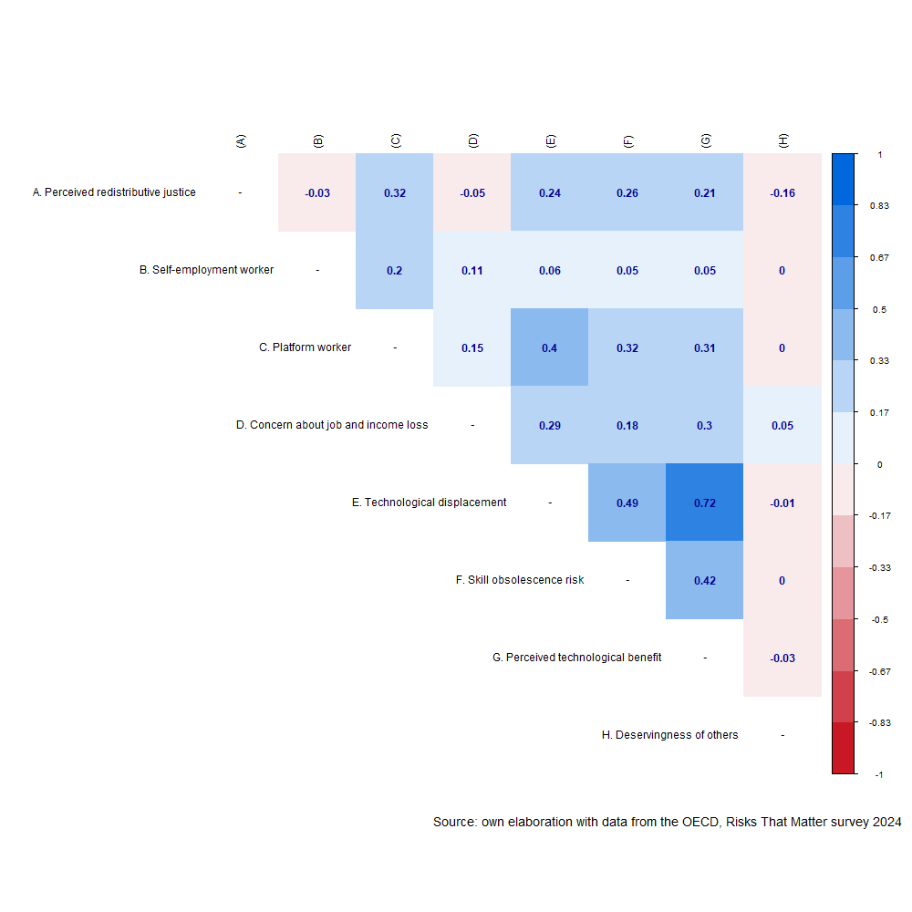


```{r ejemplo-modelo-tabla}
#| echo: false
#| warning: false


library(knitr)
knitr::opts_chunk$set(echo = TRUE, include = TRUE, warning = FALSE, message = FALSE, cache = TRUE)

table_format <- if(is_html_output()) {
  "html"
} else if(is_latex_output()) {
  "latex"
}
table_format2 <- if(is_html_output()) {
  T
} else if(is_latex_output()) {
  F
}

options(kableExtra.html.bsTable = T)
options(knitr.kable.NA = "")
```

```{r}
#| label: packages2
#| echo: false
#| include: false


if (! require("pacman")) install.packages("pacman")

pacman::p_load(tidyverse, 
               sjmisc, 
               sjPlot, 
               lme4, 
               here, 
               performance,
               marginaleffects,
               texreg, 
               ggdist,
               kableExtra,
               ggalluvial, 
               shadowtext,
               MetBrewer,
               patchwork,
               sjlabelled,
               summarytools,
               interactions,
               cowplot,
               ggpubr,
               ordinal,
               emmeans,
               huxtable,
               flextable)


options(scipen=999)
rm(list = ls())
```

```{r}
#| label: data2
#| echo: false
#| include: false 

load(file=here::here("input/proc/data.RData"))
load(file=here::here("input/proc/digitalization.RData"))
load(file=here::here("input/proc/country_data.RData"))

# Generate analytical sample
data <- data %>% select(ctrcode,country, distributive, sex, age, educ, income, selfemploy, unnemployment, platform, tecnoestres, pos_tecnoestres, deservingness, welfare_regime, weight, gini_z, gdp_pc_log_z, unemp_z, socx_z)

data <- na.omit(data)

data$distributive  <- sjlabelled::set_label(x = data$distributive, label = "Redistributive justice")
data$tecnoestres  <- sjlabelled::set_label(x = data$tecnoestres, label = "Technological displacement")
data$pos_tecnoestres  <- sjlabelled::set_label(x = data$pos_tecnoestres, label = "Perceived technological benefit")
#data$skills  <- sjlabelled::set_label(x = data$skills, label = "Lose job due skills")
data$unnemployment  <- sjlabelled::set_label(x = data$unnemployment, label = "Lose job")

data$deservingness <- as.numeric(as_factor(data$deservingness))
data$deservingness  <- sjlabelled::set_label(x = data$deservingness, label = "Deservingness of others")
#data$gdp_2024  <- sjlabelled::set_label(x = data$gdp_2024, label = "GDP per-capita")

data$selfemploy  <- sjlabelled::set_label(x = data$selfemploy, label = "Self-employment worker")
data$platform  <- sjlabelled::set_label(x = data$platform, label = "Platform worker")

data$sex  <- sjlabelled::set_label(x = data$sex, label = "Sex")
data$age  <- sjlabelled::set_label(x = data$age, label = "Age group")
data$educ  <- sjlabelled::set_label(x = data$educ, label = "Educational level")

```


```{r}
#| label: correlation
#| echo: false
#| include: false 


mat_full<- 
data %>%
  select(distributive, selfemploy, platform, unnemployment, tecnoestres, pos_tecnoestres, deservingness
         ) %>% 
  mutate_all(as.numeric) %>% 
  psych::mixedCor()

cor_full <- as.matrix(mat_full$rho)
diag(cor_full) = NA #set diagonal values to NA
# Set Row names of the matrix
rownames(cor_full) <- c("A. Perceived redistributive justice",
                        "B. Self-employment worker",
                        "C. Platform worker",
                        "D. Concern about job and income loss",
                     "E. Technological displacement",
                     "F. Perceived technological benefit",
                     "G. Deservingness of others")
#set Column names of the matrix
colnames(cor_full) <-c("(A)", "(B)","(C)","(D)", "(E)", "(F)", "(G)")
#Plot the matrix using corrplot
png("output/figures/corrplot.png",width=1000,height=1000, pointsize = 12)
corrplot::corrplot(cor_full,
  method = "color", # Cambia los círculos por color completo de cada cuadrante
  addCoef.col = "#000390", # Color de los coeficientes
  type = "upper", # Deja solo las correlaciones de arriba
  tl.col = "black", # COlor letras, rojo por defecto
  col=colorRampPalette(c("#c71824", "white", "#0068DC"))(12),
  bg = "white",
  na.label = "-")
# Agregar caption
grid::grid.text("Source: own elaboration with data from the OECD, Risks That Matter survey 2024", x = 0.99, y = 0.1, just = "right", gp = grid::gpar(fontsize = 14, col = "black"))
dev.off()
```


@fig-correlation presents the correlation matrix of the main variables, with coefficients ranging from low to moderate. The strongest associations of perceived redistributive justice are with being a platform worker (r = 0.32, p < 0.001), perceived technological benefit (r = 0.26, p < 0.001) and technological displacement (r = 0.24, p < 0.001), all of them positive and moderate. Deservingness of others, in contrast, shows a negative association (r = −0.16, p < 0.01).

Among the independent variables, concern about job and income loss correlates with being a platform worker (r = 0.15, p < 0.001) and with the two technological perceptions (r = 0.30 with displacement; r = 0.17 with benefit). Technological displacement and perceived benefit are themselves positively correlated (r = 0.48), contrary to the initial intuition that risk and benefit perceptions would be negatively related.

```{r echo=FALSE}
#| label: fig-correlation
#| fig-cap: "Correlation matrix of the main variables"
#| fig-cap-location: top

 
```

## Multilevel ordinal logistic regression models

```{r}
#| echo: false
#| include: false 
#| cache: true

data$selfemploy <- sjlabelled::set_labels(data$selfemploy,
            labels=c( "No"=1,
                      "Yes"=2))
data$platform <- sjlabelled::set_labels(data$platform,
            labels=c( "No"=1,
                      "Yes"=2))

data$distributive <- as_factor(data$distributive)

m0 <- clmm(distributive ~ 1 + (1 | ctrcode), 
                data = data, weights=weight)
performance::icc(m0, by_group = T)

# level 1
reg1 <- clmm(distributive ~ selfemploy + platform + (1|ctrcode), data=data, weights=weight)
reg2 <- clmm(distributive ~ selfemploy + platform + unnemployment + (1|ctrcode), data=data, weights=weight)
reg3 <- clmm(distributive ~ selfemploy + platform + unnemployment + tecnoestres + pos_tecnoestres + (1|ctrcode), data=data, weights=weight)
reg4 <- clmm(distributive ~ selfemploy + platform + unnemployment + tecnoestres + pos_tecnoestres + deservingness + (1|ctrcode), data=data, weights=weight)

# controls
#reg5 <- clmm(distributive ~ selfemploy + platform + unnemployment + tecnoestres + pos_tecnoestres + deservingness + welfare_regime+ (1|ctrcode), data=data, weights=weight)
reg5 <- clmm(distributive ~ sex + age + educ + income + selfemploy + platform + unnemployment + tecnoestres + pos_tecnoestres + deservingness + (1|ctrcode), data=data, weights=weight)

# level 2
#reg6 <- clmm(distributive ~ sex + age + educ + income + selfemploy + platform + unnemployment + tecnoestres + pos_tecnoestres + deservingness + gini_z + (1|ctrcode), data=data, weights=weight)
reg6 <- clmm(distributive ~ sex + age + educ + income + selfemploy + platform + unnemployment + tecnoestres + pos_tecnoestres + deservingness + gini_z + gdp_pc_log_z + (1|ctrcode), data=data, weights=weight)
#reg8 <- clmm(distributive ~ sex + age + educ + income + selfemploy + platform + unnemployment + tecnoestres + pos_tecnoestres + deservingness + gini_z + gdp_pc_log_z + unemp_z + (1|ctrcode), data=data, weights=weight)
reg7 <- clmm(distributive ~ sex + age + educ + income + selfemploy + platform + unnemployment + tecnoestres + pos_tecnoestres + deservingness + gini_z + gdp_pc_log_z + unemp_z + socx_z + (1|ctrcode), data=data, weights=weight)
reg8 <- clmm(distributive ~ sex + age + educ + income + selfemploy + platform + unnemployment + tecnoestres + pos_tecnoestres + deservingness + gini_z + gdp_pc_log_z + unemp_z + socx_z + welfare_regime + (1|ctrcode), data=data, weights=weight)

# Interactions
## platform x selfemploy
reg9 <- clmm(distributive ~ sex + age + educ + income + selfemploy + platform*selfemploy + unnemployment + tecnoestres + pos_tecnoestres + deservingness + gini_z + gdp_pc_log_z + unemp_z + socx_z + welfare_regime + (1|ctrcode), data=data, weights=weight)

## selfemploy x lvl2
reg10 <- clmm(distributive ~ sex + age + educ + income + selfemploy*welfare_regime + platform + unnemployment + tecnoestres + pos_tecnoestres + deservingness + gini_z + gdp_pc_log_z + unemp_z + socx_z + welfare_regime + (1|ctrcode), data=data, weights=weight)

## platform x lvl2
reg11 <- clmm(distributive ~ sex + age + educ + income + selfemploy + platform*welfare_regime + unnemployment + tecnoestres + pos_tecnoestres + deservingness + gini_z + gdp_pc_log_z + unemp_z + socx_z + welfare_regime + (1|ctrcode), data=data, weights=weight)


reg12 <- clmm(distributive ~ sex + age + educ + income + selfemploy + platform + unnemployment*welfare_regime + tecnoestres + pos_tecnoestres + deservingness + gini_z + gdp_pc_log_z + unemp_z + socx_z + welfare_regime + (1|ctrcode), data=data, weights=weight)
reg13 <- clmm(distributive ~ sex + age + educ + income + selfemploy + platform + unnemployment + tecnoestres*welfare_regime + pos_tecnoestres + deservingness + gini_z + gdp_pc_log_z + unemp_z + socx_z + welfare_regime + (1|ctrcode), data=data, weights=weight)
reg14 <- clmm(distributive ~ sex + age + educ + income + selfemploy + platform + unnemployment + tecnoestres + pos_tecnoestres + deservingness*welfare_regime + gini_z + gdp_pc_log_z + unemp_z + socx_z + welfare_regime + (1|ctrcode), data=data, weights=weight)


texreg::knitreg(list(reg1, reg2, reg3, reg4, reg5, reg6, reg7, reg8))
texreg::knitreg(list(reg9, reg10, reg11, reg12, reg13, reg14))


```


```{r echo=FALSE}
#| label: tbl-modelos
#| tbl-cap: "Multilevel models for perceived redistributive justice"
#| tbl-cap-location: top

omit <- "(1|2)|(2|3)|(3|4)|(4|5)|(sex)|(age)|(educ)|(income)"

ccoef <- list(
  "selfemploy2" = "Self-employed worker (ref. No)",
  "platform2" = "Platform worker (ref. No)",
  "unnemployment" = "Concern about job and income loss",
  "tecnoestres" = "Technological displacement",
 # "skills" = "Skill obsolescence risk",
  "pos_tecnoestres" = "Perceived technological benefit",
  deservingness = "Deservingness of others",
  gini_z = "Gini coefficient (standardised)",
  gdp_pc_log_z = "GDP per capita (standardised)",
  unemp_z = "Unemployment rate (standardised)",
  socx_z = "Social expenditure (standardised)",
  "welfare_regimeSocial-democratic" = "Social-democratic",
  "welfare_regimeConservative" = "Conservative"
  )

mat1 <- matrixreg(list(reg1, reg2, reg3, reg4, reg5, reg6, reg7, reg8),
        custom.model.names = paste0("Model ", 1:8),
        stars = c(0.05, 0.01, 0.001),
        omit.coef = omit,
        custom.coef.map = ccoef,
        digits = 3,
        leading.zero = TRUE,
        include.loglik = FALSE,
        include.aic = FALSE,
        custom.gof.names = c("BIC", "Numb. obs.", "Groups (Country)",
                             "Variance: Country: (Intercept)"),
        output.type = "ascii",
        trim = TRUE)

df1 <- as.data.frame(mat1[-1, , drop = FALSE], stringsAsFactors = FALSE)
names(df1) <- c("term", mat1[1, -1])

# Fila de grupo antes de Social-democratic
# (reemplaza al argumento groups de texreg)
pos <- which(df1$term == "Social-democratic")[1]
grp <- df1[1, ]
grp[1, ] <- ""
grp$term <- "Welfare regime (Ref.= Liberal)"
df1 <- rbind(df1[1:(pos - 1), ], grp, df1[pos:nrow(df1), ])

ft1 <- flextable::flextable(df1) %>%
  flextable::set_header_labels(term = "") %>%
  flextable::bold(part = "header") %>%
  flextable::italic(i = pos, j = 1, part = "body") %>%
  flextable::align(j = 2:9, align = "center", part = "all") %>%
  flextable::padding(padding.top = 0, padding.bottom = 0,
                     padding.left = 2, padding.right = 2, part = "all") %>%
  flextable::line_spacing(space = 0.9, part = "all") %>%
  flextable::fontsize(size = 8, part = "all") %>%
  flextable::add_footer_lines("Note: Cells contain regression coefficients with standard errors in parentheses. * p < 0.05; ** p < 0.01; *** p < 0.001. Models 5 to 8 control for sex, age, education and income; sex, age and income show significant effects, education does not.") %>%
  flextable::fontsize(size = 7, part = "footer") %>%
  flextable::set_table_properties(layout = "fixed") %>%
  flextable::width(j = 1, width = 4.0, unit = "cm") %>%
  flextable::width(j = 2:9, width = 1.6, unit = "cm")

ft1
```

Cumulative-link mixed models were fitted for perceived redistributive justice, with a random intercept for country. Note that the ordinal package reports the number of observations as the sum of the sampling weights rather than the count of cases [@haubo_cumulative_2018]; the models were therefore estimated on `r format(nrow(data), big.mark = ",")` respondents nested in 27 countries (weighted N = 17,296). Coefficients are cumulative log-odds, where a positive value indicates greater odds of reporting a higher category of perceived redistributive justice. The intra-class correlation of the null model places 6.8% of the variance of perceived redistributive justice at the country level.

@tbl-modelos follows a block-building logic at the individual level — type of employment (Model 1), concern about job and income loss (Model 2), the technological perceptions (Model 3), deservingness of others (Model 4) and sociodemographic controls (Model 5). Country-level variables enter in the following models, with the Gini coefficient and GDP per capita in Model 6, the unemployment rate and social expenditure in Model 7 and the welfare regime in Model 8, all macro indicators standardised. Between the first and the final model the country-level variance declines from 0.238 to 0.111, with the sharpest drop when the macroeconomic indicators enter (0.227 to 0.135 in Model 6). The BIC reaches its minimum in Model 5 (49,766.8) and rises slightly across the macro blocks, indicating that the country-level indicators absorb between-country variance without improving overall fit.

Platform work is the strongest and most stable predictor. In Model 1 its coefficient is 1.177 (p < 0.001); it attenuates as the technological and deservingness variables enter but remains large in the fully adjusted Model 8 (0.787, p < 0.001), so platform workers have roughly twice the odds of expressing higher perceived redistributive justice. Self-employment is non-significant throughout (≈ −0.06). Concern about job and income loss is negative and strengthens once technological perceptions are held constant, moving from −0.058 in Model 2 to −0.163 in Model 8 (p < 0.001).

The technological perceptions (from Model 3) are uniformly positive. Perceived technological benefit carries the largest effect (≈ 0.44–0.47, p < 0.001), followed by technological displacement (≈ 0.35–0.37, p < 0.001). The positive sign on technological displacement runs counter to the hypothesised direction, a point developed further in the discussion. Deservingness of others (Model 4) is negative and stable (≈ −0.18, p < 0.001), and the addition of sociodemographic controls in Model 5 leaves this individual-level structure essentially unchanged.

At the country level, GDP per capita is the only macroeconomic indicator with a significant association: perceived redistributive justice is higher in richer countries (0.217, p < 0.05 in Model 6; 0.191, p < 0.05 in Model 8), and its inclusion absorbs a substantial share of the between-country variance. The Gini coefficient, the unemployment rate and social expenditure are not significant. Welfare regime, entered in Model 8 net of these indicators, shows one significant contrast: perceived justice is lower in conservative regimes than in liberal ones (−0.350, p < 0.05), while the social-democratic contrast is non-significant (−0.154).

```{r echo=FALSE}
#| label: tbl-interact
#| tbl-cap: "Multilevel interaction models for perceived redistributive justice"
#| tbl-cap-location: top

omit2 <- "(1|2)|(2|3)|(3|4)|(4|5)|(sex)|(age)|(educ)|(income)|(pos_tecnoestres)|(gini_z)|(gdp_pc_log_z)|(unemp_z)|(socx_z)"

ccoef2 <- list(
  "selfemploy2" = "Self-employed worker (ref. No)",
  "platform2" = "Platform worker (ref. No)",
  "unnemployment" = "Concern about job and income loss",
  "tecnoestres" = "Technological displacement",
  deservingness = "Deservingness of others",
  "welfare_regimeSocial-democratic" = "Social-democratic",
  "welfare_regimeConservative" = "Conservative",
  "selfemploy2:platform2" = "Self-employed X Platform worker",
  "selfemploy2:welfare_regimeSocial-democratic" = "Self-employed X Social-democratic",
  "selfemploy2:welfare_regimeConservative" = "Self-employed X Conservative",
  "platform2:welfare_regimeSocial-democratic" = "Platform worker X Social-democratic",
  "platform2:welfare_regimeConservative" = "Platform worker X Conservative",
  "unnemployment:welfare_regimeSocial-democratic" = "Job and income loss X Social-democratic",
  "unnemployment:welfare_regimeConservative" = "Job and income loss X Conservative",
  "tecnoestres:welfare_regimeSocial-democratic" = "Technological displacement X Social-democratic",
  "tecnoestres:welfare_regimeConservative" = "Technological displacement X Conservative",
  "deservingness:welfare_regimeSocial-democratic" = "Deservingness X Social-democratic",
  "deservingness:welfare_regimeConservative" = "Deservingness X Conservative"
  )

mat2 <- matrixreg(list(reg9, reg10, reg11, reg12, reg13, reg14),
        custom.model.names = paste0("Model ", 9:14),
        stars = c(0.05, 0.01, 0.001),
        omit.coef = omit2,
        custom.coef.map = ccoef2,
        digits = 3,
        leading.zero = TRUE,
        include.loglik = FALSE,
        include.aic = FALSE,
        custom.gof.names = c("BIC", "Numb. obs.", "Groups (Country)",
                             "Variance: Country: (Intercept)"),
        output.type = "ascii",
        trim = TRUE)

df2 <- as.data.frame(mat2[-1, , drop = FALSE], stringsAsFactors = FALSE)
names(df2) <- c("term", mat2[1, -1])

ft2 <- flextable::flextable(df2) %>%
  flextable::set_header_labels(term = "") %>%
  flextable::bold(part = "header") %>%
  flextable::align(j = 2:7, align = "center", part = "all") %>%
  flextable::padding(padding.top = 0, padding.bottom = 0, part = "all") %>%
  flextable::line_spacing(space = 0.9, part = "all") %>%
  flextable::fontsize(size = 8, part = "all") %>%
  flextable::add_footer_lines("Note: Cells contain regression coefficients with standard errors in parentheses. * p < 0.05; ** p < 0.01; *** p < 0.001. All models control for sex, age, education and income; sex, age and income show significant effects, education does not.") %>%
  flextable::fontsize(size = 7, part = "footer") %>%
  flextable::set_table_properties(layout = "fixed") %>%
  flextable::width(j = 1, width = 5.2, unit = "cm") %>%
  flextable::width(j = 2:7, width = 1.75, unit = "cm")

ft2
```

@tbl-interact takes the fully adjusted specification and introduces one interaction at a time: self-employed × platform (Model 9), followed by the cross-level products of welfare regime with self-employment (Model 10), platform work (Model 11), concern about job and income loss (Model 12), technological displacement (Model 13) and deservingness (Model 14). The BIC varies little across these models (49,797.3–49,818.8) and the country variance is stable (≈ 0.11). The four regime moderations are displayed in @fig-interact; because the emmeans package [@lenth_emmeans_2017] evaluates the fitted model on the latent scale, the panels show predicted latent propensity rather than category-specific probabilities, which is why each moderation reduces to a single linear panel.

The individual-level interaction is negative (self-employed × platform = −0.368 (p < 0.01)), so the platform effect is weaker among workers who are simultaneously self-employed. The cross-level terms then qualify the regime contrasts of @tbl-modelos. Self-employment matters only in social-democratic regimes (× social-democratic = −0.418, p < 0.001; × conservative n.s.), shown in the top-left panel of @fig-interact as the steep social-democratic decline against flat liberal and conservative lines. Platform work is positive across all regimes (top right), but its slope is much shallower under social-democratic arrangements (× social-democratic = −0.596, p < 0.001; × conservative n.s.).

The remaining interaction terms are also negative. Technological displacement is positive in every regime (bottom left) but significantly attenuated relative to liberal regimes (× social-democratic = −0.258; × conservative = −0.136; both p < 0.001). Deservingness is negative throughout (bottom right), and here the negative interaction implies amplification rather than attenuation, where the slope is steepest in conservative regimes (× conservative = −0.081, p < 0.01), with a non-significant social-democratic term. Concern about job and income loss interacts significantly only with the conservative contrast (−0.115, p < 0.001). The conservative main effect, significant in Models 9 to 11 (≈ −0.33 to −0.35, p < 0.05), loses significance in Models 12 to 14, where it refers to the contrast at the zero point of the interacted predictor rather than to an average difference.

A consistent pattern emerges throughout the models, where every regime interaction with an individual-level predictor is negative, so each association is weaker (or more adverse) than under liberal arrangements. For platform work and technological displacement this translates into visibly flatter slopes in social-democratic regimes, consistent with the view that encompassing welfare institutions partially decouple distributive attitudes from individual technological exposure. The exceptions to this dampening logic are self-employment, which becomes consequential (and negative) only under social-democratic arrangements, and deservingness, whose negative gradient is steepest in conservative regimes.

```{r echo=FALSE}
df1 <- emmip(reg10, welfare_regime ~ selfemploy,
             mode = "latent", CIs = FALSE, plotit = FALSE)

int1 <- ggplot(df1, aes(x = selfemploy, y = yvar,
                        color = welfare_regime, shape = welfare_regime,
                        group = welfare_regime)) +
  geom_line() +
  geom_point(size = 2.8) +
  scale_shape_manual(values = c(16, 17, 15)) +
  scale_x_discrete(name = "Self-employed workers", labels = c("No", "Yes")) +
  scale_y_continuous(name = "Perceived redistributive justice (latent scale)",
                    limits = c(-0.7, 0.8), breaks = c(-0.6, -0.3, 0, 0.3, 0.6))+
  labs(color = "Welfare regime", shape = "Welfare regime") +
  theme_bw()
```


```{r echo=FALSE}
df2 <- emmip(reg11, welfare_regime ~ platform,
             mode = "latent", CIs = FALSE, plotit = FALSE)

int2 <- ggplot(df2, aes(x = platform, y = yvar,
                        color = welfare_regime, shape = welfare_regime,
                        group = welfare_regime)) +
  geom_line() +
  geom_point(size = 2.8) +
  scale_shape_manual(values = c(16, 17, 15)) +
  scale_x_discrete(name = "Platform workers", labels = c("No", "Yes")) +
  scale_y_continuous(name = "Perceived redistributive justice (latent scale)",
                    limits = c(-0.7, 0.8), breaks = c(-0.6, -0.3, 0, 0.3, 0.6))+
  labs(color = "Welfare regime", shape = "Welfare regime") +
  theme_bw()
```

```{r echo=FALSE}
nui <- c("sex", "age", "educ", "income", "platform")

df3_line <- emmip(reg13, welfare_regime ~ tecnoestres,
                  at = list(tecnoestres = seq(1, 4, length.out = 50)),
                  nuisance = nui, mode = "latent", CIs = FALSE, plotit = FALSE)
df3_pts  <- emmip(reg13, welfare_regime ~ tecnoestres,
                  at = list(tecnoestres = seq(1, 4, length.out = 4)),
                  nuisance = nui, mode = "latent", CIs = FALSE, plotit = FALSE)

int3 <- ggplot(df3_line, aes(x = tecnoestres, y = yvar,
                             color = welfare_regime, group = welfare_regime)) +
  geom_line(linewidth = 0.8) +
  geom_point(data = df3_pts, aes(shape = welfare_regime), size = 2.8) +
  scale_shape_manual(values = c(16, 17, 15)) +
  scale_x_continuous(name = "Technological displacement") +
  scale_y_continuous(name = "Perceived redistributive justice (latent scale)",
                    limits = c(-0.7, 0.8), breaks = c(-0.6, -0.3, 0, 0.3, 0.6))+
  labs(color = "Welfare regime", shape = "Welfare regime") +
  theme_bw()
```

```{r echo=FALSE}
df4_line <- emmip(reg14, welfare_regime ~ deservingness,
                  at = list(deservingness = seq(1, 5, length.out = 50)),
                  nuisance = nui, mode = "latent", CIs = FALSE, plotit = FALSE)
df4_pts  <- emmip(reg14, welfare_regime ~ deservingness,
                  at = list(deservingness = seq(1, 5, length.out = 5)),
                  nuisance = nui, mode = "latent", CIs = FALSE, plotit = FALSE)

int4 <- ggplot(df4_line, aes(x = deservingness, y = yvar,
                             color = welfare_regime, group = welfare_regime)) +
  geom_line(linewidth = 0.8) +
  geom_point(data = df4_pts, aes(shape = welfare_regime), size = 2.8) +
  scale_shape_manual(values = c(16, 17, 15)) +
  scale_x_continuous(name = "Deservingness of others") +
  scale_y_continuous(name = "Perceived redistributive justice (latent scale)",
                    limits = c(-0.7, 0.8), breaks = c(-0.6, -0.3, 0, 0.3, 0.6))+
  labs(color = "Welfare regime", shape = "Welfare regime") +
  theme_bw()
```


```{r echo=FALSE}
#| label: fig-interact
#| fig-cap: "Estimated latent propensity for perceived redistributive justice, by selected predictors across welfare regimes"
#| fig-cap-location: top
#| fig-subcap: "Source: own elaboration with data from the OECD, Risks That Matter survey 2024."

int1 <- int1 + theme(axis.title.y = element_blank())
int2 <- int2 + theme(axis.title.y = element_blank())
int3 <- int3 + theme(axis.title.y = element_blank())
int4 <- int4 + theme(axis.title.y = element_blank())

fig <- ggarrange(
  int1, int2,
  int3, int4,
  ncol = 2,
  nrow = 2,
  common.legend = TRUE,
  legend = "top"
)

annotate_figure(
  fig,
  left = text_grob(
    "Perceived redistributive justice (latent scale)",
    rot = 90
  )
)
```